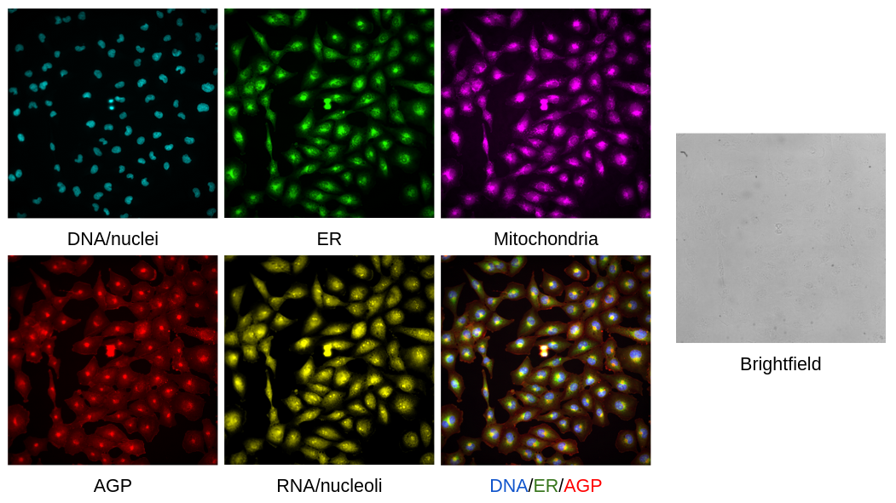
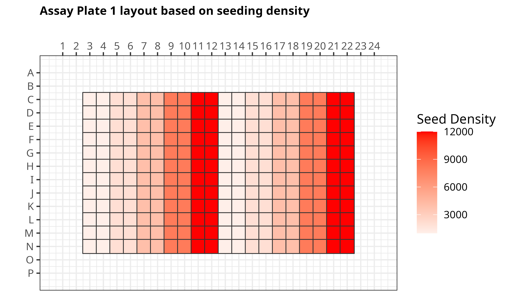
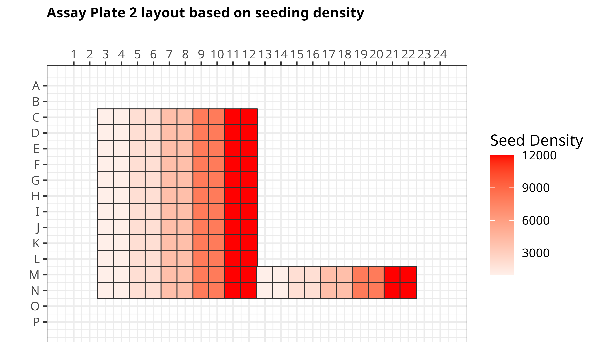

# Pediatric cancer atlas image profiling

In this repository, we perform image analysis to extract single cell morphological profiles and image-based profiling to format the profiles to be processed with machine learning and other analyses.

## Cell Painting

We performed a traditional [Cell Painting assay](https://www.nature.com/articles/nprot.2016.105) on multiple different pediatric cancer cell lines.
Images were acquired using an Opera Phenix 1 High Content Screening System.

In this assay, we have six channels (five Cell Painting + Brightfield). 
These channels are listed in the number order that you can find for the TIFF images, with the channel name in the XML file bolded:

1. **Brightfield high**
2. Concanavalin A **Alexa 488** - Endoplasmic reticulum (ER)
3. Phalloidin and WGA **Alexa 568** - Actin, Golgi, and plasma membrane (AGP)
4. MitoTracker **Alexa 647** - Mitochondria
5. **Hoechst 33342** - DNA/nucleus
6. SYTO14 **Alexa 488 long** - Cytoplasmic RNA and nucleoli 



## Data

### Pilot dataset

To assess the optimal seeding density and time point across all cell lines, we acquired six plates of preliminary data with 18 unique cell lines.
There are two platemap layouts, with each layout having three time points (24, 48, and 72 hours) per plate (e.g., 2 layouts * 3 time points = 6 plates).
Per plate, there are five different seeding densities across the wells (1000, 2000, 4000, 8000, 12000).
**We will use various methods to determine what are the best conditions per cell line.**
One method we will perform in this repository is single-cell quality control (QC), in which we will output a QC report that can tell us which seeding densities and time points yielded the worst quality segmentations.
This can be due to high confluence or poor staining.

Below are the examples of the plate map layouts based on seeding density:



> First plate layout labelled by seeding density per well.



> Second plate layout labelled by seeding density per well. There are less wells used on this plate.

**NOTE:** Both plate layouts contain U2-OS cell line in the same place. Also, any empty portions of the layout only contain media and no cells so they are not included on figure.

## Repository structure

| Module | Purpose | Description |
| :---- | :----- | :---------- |
| [0.download_data](0.download_data/) | Download plates and platemaps | Download all relevant data (images, XML files, platemap files) to process. All metadata information will be found in this module. |

## Environments

In this module, we include three different environments:

- **[R environment](./r_environment.yml):** This environment is used for any notebook that requires visualization of results and figure generation in R language.
- **Image profiling environment**: This environment is used during the preprocessing module after we extract morphology features using CellProfiler, which includes installing relevant formatting software such as pycytominer, CytoTable, and coSMicQC.
- **CellProfiler environment:** This environment is used for the illumination correction and feature extraction modules as we will be using CellProfiler v4.2.8 to perform these tasks. 

These environments can be installed either via conda or mamba.
Below is an example of how to install via the terminal.

```bash
# Make sure to be in this repo as the current directory
mamba env create -f ...
```
